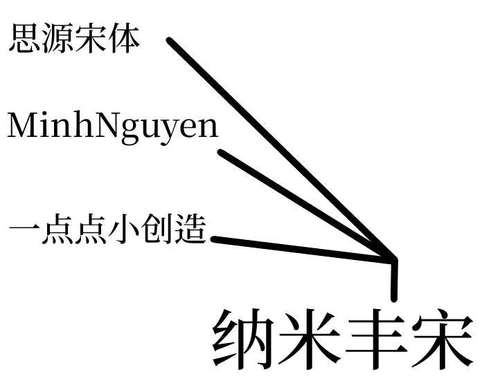

# 纳米丰宋(NanoFullSong) [更新]
### 作者：HACKERSam    |    邮箱:3582930858@qq.com

## 说明
此字体专门为系统、文字研究、方言研究开发的宋体字体，由**思源宋体**改编

## 收录

支持西文字母、方言用字、国标一级二级用字、部分国标三级用字及汉喃字；完全支持中日韩基本区及扩展A区

> [!WARNING]
>
> 字体制作有可能有一些误差，字符有可能会错误或制作不精良
> 
> 一旦发现这些问题，请联系**HACKERSam**，我们期待您的消息

## 制作人员名单

|专项|名称|联系方式|
|-|-|-|
|制作人员|**HACKERSam**|3582930858@qq.com|
|提意见者|敬请期待|敬请期待|
|赞助者|敬请期待|敬请期待|

## 版权

本字体基于 SIL Open Font License 修改，字体本身可开源，不得发售

## 加入我们

您可以加入QQ群：**723768896**，来与我们一起讨论、交流（此群为NANOFONT纳米字库交流群）

## 备注
上一次更新：2024/8/7
